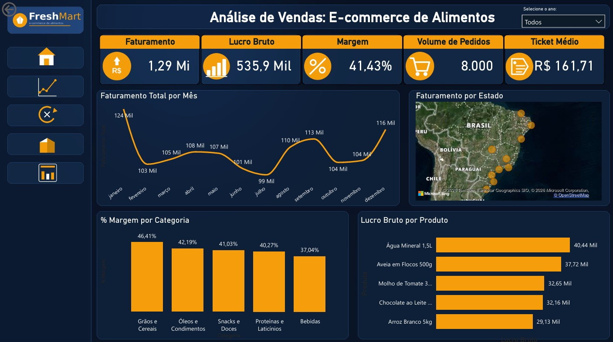
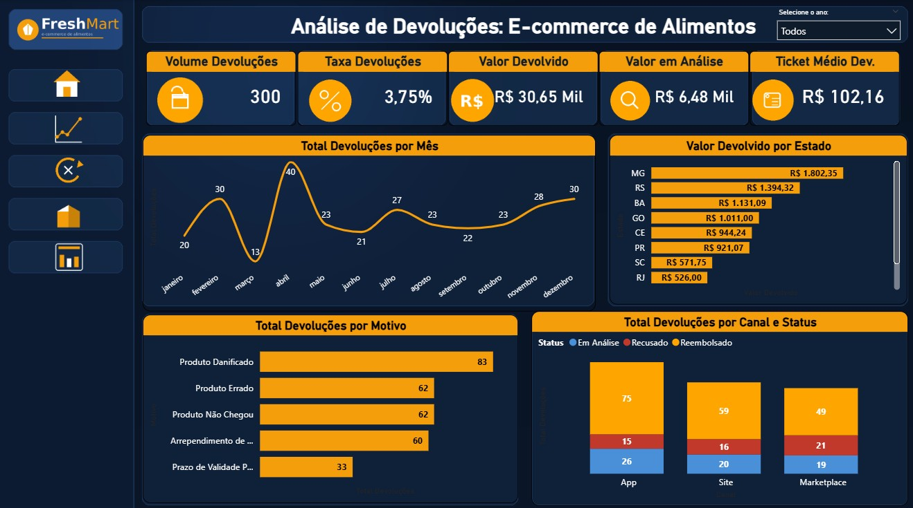
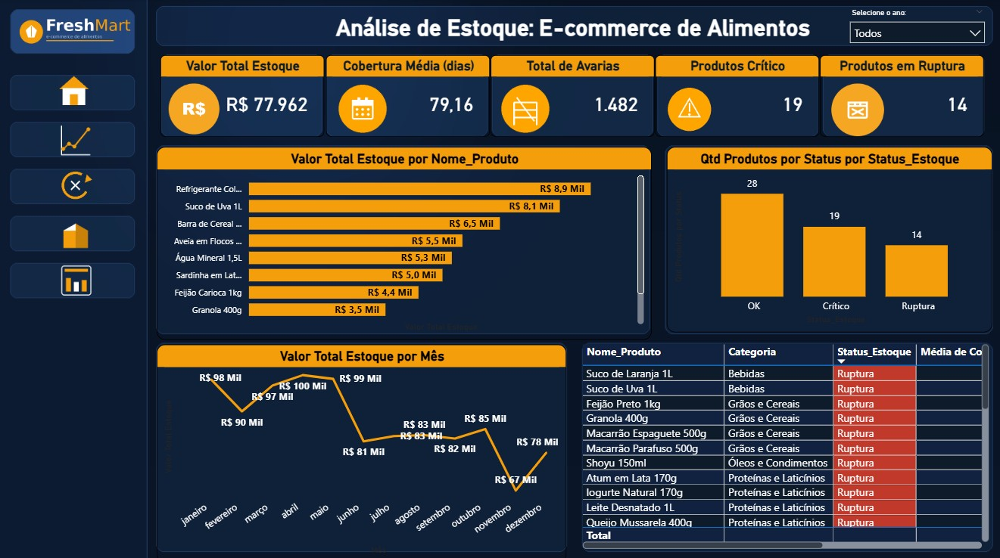
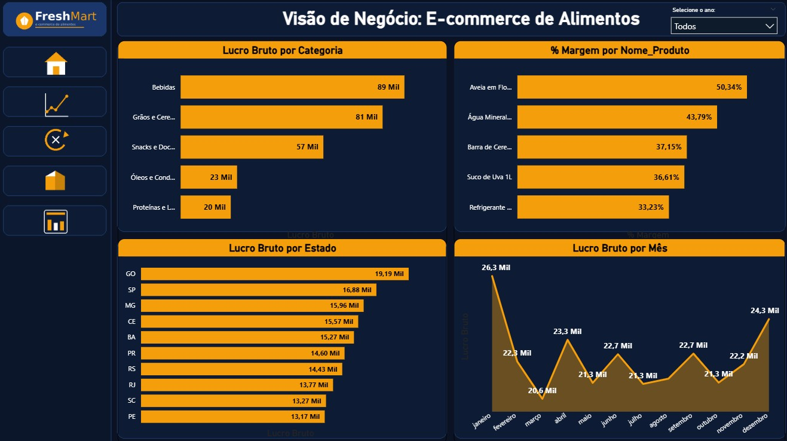

# FreshMart | Dashboard de Vendas e Operações

Dashboard de análise de um e-commerce de alimentos e bebidas desenvolvido em Power BI.
Cobre vendas, devoluções, estoque e rentabilidade em 5 páginas com navegação integrada.

> Os dados deste projeto são fictícios, gerados para fins de portfólio.

> Relatório interativo no Power BI Service será disponibilizado em breve.

---

## Páginas do Dashboard

### Capa
Apresentação do relatório com navegação entre páginas.

### Vendas
Faturamento, lucro bruto, margem, volume de pedidos e ticket médio.
Evolução mensal, distribuição por estado e ranking de produtos por lucro.

---

### Devoluções
Volume e valor de devoluções, taxa de devolução, motivos de retorno e status dos reembolsos.
Distribuição por canal (Site, Marketplace, App) e por estado.

---

### Estoque
Valor total em estoque, cobertura em dias, avarias, produtos em status crítico e em ruptura.
Evolução mensal do valor de estoque e tabela de alertas por produto.

---

### Visão de Negócio
Lucro bruto por categoria, margem por produto, desempenho por estado e evolução mensal do lucro.

---

## Modelo de Dados

Star Schema com 3 tabelas fato e 2 tabelas dimensão.

| Tabela | Tipo | Registros | Descrição |
|---|---|---|---|
| fVendas | Fato | 8.000 linhas | Receita, custo, lucro, canal, estado |
| fDevolucoes | Fato | 300 linhas | Motivo, status e valor reembolsado |
| fEstoque | Fato | 672 linhas | Entradas, saídas, avarias, cobertura em dias |
| dProdutos | Dimensão | 28 produtos | Categoria, preço e custo por SKU |
| dCalendario | Dimensão | 731 dias | Calendário 2023-2024 com ano, trimestre e mês |

---

## KPIs

| KPI | Descrição |
|---|---|
| Faturamento Total | Receita líquida após descontos |
| Lucro Bruto | Receita menos custo da mercadoria |
| Margem Bruta (%) | Lucro / Receita |
| Taxa de Devolução (%) | Percentual de itens devolvidos por pedido |
| Valor em Estoque | Estoque final x custo unitário |
| Cobertura em Dias | Dias estimados até ruptura |
| Produtos em Ruptura | SKUs com estoque zerado |

---

## Ferramentas

- Power BI Desktop (modelagem, DAX e visuais)
- Star Schema
- DAX para medidas calculadas

---

## Autor

**Leonardo Guerrera** — Engenheiro de Produção com 9+ anos em Supply Chain e Logística.

